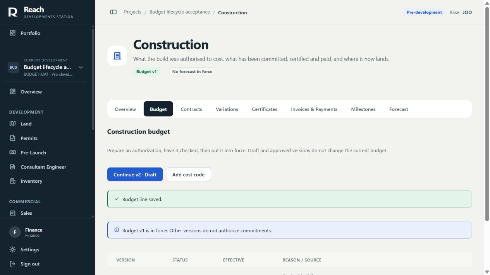

# Construction MVP: Budget and Contract stream

Authority: [MVP finish plan](UX_MVP_FINISH_2026_09_11.md),
[Engineering Rules](ENGINEERING_RULES.md), and [Architecture](ARCHITECTURE.md).
Budget base: merged UX-12 #286, main `3844623`.

## Two bounded delivery slices

1. **Budget lifecycle (this candidate):** create project cost codes as a prerequisite;
   prepare an opening budget or copied revision; record every active code, including
   explicit zero; submit; independently approve/reject; activate; inspect history
   and source; return an approved candidate for correction when eligible.
2. **Contract/commitment lifecycle (next separate PR):** prepare the contract header
   and cost-code lines using existing domain contracts; make required totals,
   currency, budget headroom and role checks actionable; submit and complete the
   existing review/activation journey; preserve return context and history. Verify
   current API transitions before implementation. Only add prerequisites proven
   necessary to complete this journey.

Both use existing API services, monetary calculators, role/scope rules,
FormDialog/DraftBoundary, useAnswer and URL state. Budget is an authorization;
Contract is a commitment. Draft or approved candidates do not change the budget
in force. No forecast, certification, variation, invoice or payment editor is
included. Reconcile the official broader MVP scope before declaring the release
complete; this sequence does not silently accept deferred workflows.

## Budget implementation and contract impact

The register separates the active authorization, the single open candidate and
version history. A selected version is bookmarked by `constructionTab=budget`
and `budgetVersion`; Back returns to Budget versions. The editor preserves exact
amount strings and copied baselines. The small Add cost code form enables an
empty project to start without database/API setup by an operator.

Budget detail responses add actor-specific `workflow` blockers for editing,
submission, approval, rejection and activation, plus missing active cost codes.
Null means the current actor may attempt that action; locked writes recheck the
same submission/activation/rejection prerequisites. Read-only and unauthorized
actors receive explanations, not enabled write buttons. Master exceptions and
whole-project scope enforcement remain existing policy.

The existing rejection endpoint also accepts an approved candidate. This closes
the single-open-version dead end after a failed activation. CFO authority,
independent checking, reason, immutable lines, approval timestamps and the
existing `construction.budget_rejected` audit event are retained. Active and
superseded budgets cannot be rejected. An active forecast referencing the
candidate blocks its return under the same project lock used by forecast
activation. Open forecasts retain existing governed-budget validation.

No schema, migration, dependency, deployment configuration, currency, rounding
or calculation changes. The server still calculates control budget/headroom and
refuses activation that would underfund standing commitments. Existing opening
baseline rules are unchanged. API and frontend must deploy together for the
additive workflow response consumed by this workspace.

## Observed browser acceptance

Local static build on a separate synthetic PostgreSQL clone, project
**Budget lifecycle acceptance**. No production records were used.

| Journey | Observed result |
| --- | --- |
| Finance, empty project | Add cost code and Create first budget completed from the UI |
| Missing budget line | Submission disabled with server explanation; Record BLD-01 offered |
| Monetary entry | 1,000,000.25 authorization, explicit zero contingency and 900,000 baseline saved exactly |
| Cancel edited line, Stay | Unsaved-change dialog appeared; Stay retained amounts; subsequent save succeeded |
| Finance submission | Draft froze; Approve/Reject disabled with CFO authority explanation |
| Independent CFO approval | Approval completed while no budget was yet in force |
| CFO activation and reload | v1 became in force; selected Budget/version context survived reload |
| Finance revision | Copied v1, edited authorization to 1,200,000.50; original baseline remained read-only |
| Back to versions | v1 in force and v2 draft remained visibly distinct; Continue v2 offered |
| Phone 390 x 844 | Project identity and return action visible; text/cards readable; monetary table uses its own horizontal scrolling; document width remained within viewport |

Desktop and phone screenshots were visually inspected. The phone full-page
capture showed a stitching artifact, so it is not used as release evidence.
Browser testing is synthetic engineering acceptance, not real operator UAT or
comprehensive screen-reader/cross-browser acceptance.

## Automated validation

Final results are recorded with the Draft PR. Coverage includes missing-code
eligibility, ordinary and dual-role maker/checker rules, future activation,
approved-candidate return/copy recovery, and refusal to withdraw an active
forecast basis. Existing budget/currency/security/contract/forecast regression
suites protect monetary and downstream behavior. Frontend tests exercise
failed-read Retry, exact decimal payloads without baseline restatement,
retained rejection reasons and blocked activation.

Independent review, exact-head Full gates after Ready, human merge, operator
UAT and the eventual MVP freeze remain separate gates.
