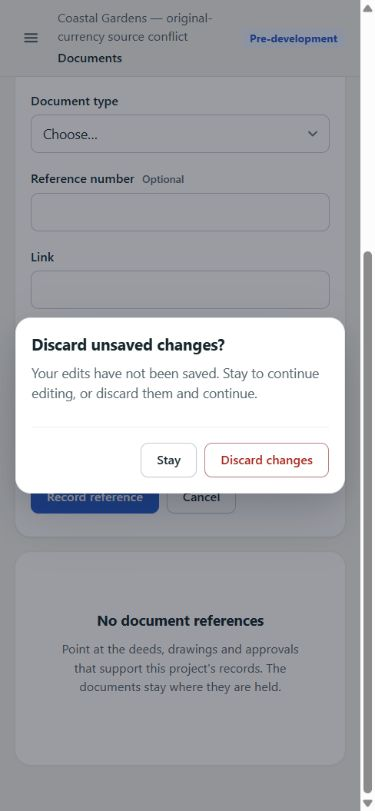

# UX-12 — Draft safety and recovery closure

Candidate governed by [Engineering Rules](ENGINEERING_RULES.md),
[Architecture](ARCHITECTURE.md), and the bounded
[MVP finish plan](UX_MVP_FINISH_2026_09_11.md). Base: merged UX-11, main `81da292`.

## Change

Documents new references, Payment Plan creation, Land parcel/planning forms,
and Permit creation/status transitions now use the existing `DraftBoundary`.
Changed values prompt before leaving, cancelling, closing a drawer, or changing
sections. Stay retains the inputs; Discard restores the initial/saved baseline.
Unchanged forms do not prompt. In-flight writes disable the fields. Failed writes
keep their inputs; successful writes reset the baseline or close the editor.
No local-storage draft persistence or new navigation/state framework is added.

Principal failed reads now offer a read-only Retry in Documents, Payment Plans,
Pre-Launch, Consultant Engineer, Portfolio, and all eight Construction views
(summary plus seven subregisters). Construction Budget/Forecast recovery also
clears a previous error when the successful response contains no versions.
Manual retries show a pending label and disable their button while reading;
Portfolio reuses `useAnswer`'s loading/retry behavior. Permission-denied Portfolio
remains distinct from a recoverable request failure.

Documents, Pre-Launch and Consultant Engineer keep read errors separate from
write errors so reloading a register does not repeat a mutation. A successful
Consultant write closes its editor even if the following read fails, leaving
read recovery available rather than inviting a duplicate submission.

MoneyInput and RateInput add a unique accessible denomination description while
retaining caller hints/errors. Known currency is named, unknown currency says
unavailable, and rates say Percent. Exact input strings and conversion logic
are unchanged.

## Validation

- Production static build and TypeScript passed on the final application source.
- 40 frontend tests passed, including exact-value/unit accessibility and actual
  reader callback tests for seven Construction subregisters, Documents,
  Pre-Launch, Consultant Engineer, Payment Plans and Portfolio.
- 108 PostgreSQL-backed tests passed: `test_ux_copy.py`,
  `test_static_frontend.py`, `test_product_experience.py` (462.09 seconds).
- Ruff check/format, Python compilation and dependency integrity passed.
- Full frontend lint passed after correcting an effect lint finding.

Browser acceptance used a separate synthetic PostgreSQL clone, local static
build, and local-only fault middleware outside the repository. Production data
and production configuration were not used.

| Journey | Observed result |
| --- | --- |
| Documents: edit, header Cancel, Stay | Draft retained; no navigation |
| Documents: injected POST 503, then save | Title/type/link retained after failure; subsequent save succeeded and closed the form |
| Documents: Discard, reopen, clean Cancel | Cleared draft; unchanged form closed without a prompt |
| Documents: injected GET 503, Retry | Error and retry shown without a false empty register; saved reference returned after recovery |
| Land: new parcel, Close, Stay, save | Drawer close protected; parcel created |
| Planning: edit, change tab, Stay, save | Section switch protected; saved envelope and clean drawer close |
| Permits: new permit, Cancel, Stay, save | Draft protected; permit created |
| Permit status: move/reason, history tab, Stay | Selected transition/reason retained; subsequent status save succeeded |
| Permit status: injected POST 503 | Selected move and reason retained; explicit discard closed the drawer |
| Payment Plan: select contract/name, toggle editor, Stay, save | Guard retained inputs; creation navigated directly to PLN-000002 with Back to Payment Plans |
| Construction Budget: injected GET 503, Retry | Current budget restored without a write |
| Phone 390 × 844: Documents Cancel/Stay/Discard | Dialog and both actions readable; Stay retained title |

Synthetic browser checks are engineering acceptance, not real operator UAT.
Cross-browser screen-reader and native refresh/history acceptance still belongs
to operator UAT; no claim of comprehensive assistive-technology coverage is made.
The existing browser unload/traversal guard is reused.

## Review boundary

Draft candidate only: independent review and required exact-head CI remain
separate gates before human merge. No backend behavior/schema/API/financial
formula/dependency/CI changes. Historical Partial/Pending UAT remains unchanged.
Construction Budget/Contract workflows and narrow UX-13 remain separate PRs.

Production Dependencies Added: None.
Development Dependencies Added: None.
Dependencies Removed: None.
New dependency necessity / native alternative insufficiency: Not applicable.
